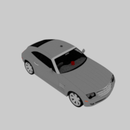
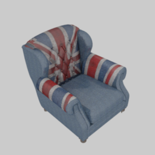
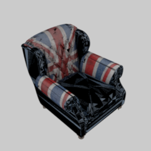

# mitsuba-shapenet

Most ShapeNet models are exported from SketchUp with double-faces. In original Mitsuba renderer without back-face culling, there are black pixels when intersecting the 'back side' face. There are also some categories, such as cars, are not double-sided. Some of them only have flipped faces, which makes backface culling not work.

This fork simply implements a 'shapenet' shape importer. It reads model and material from ShapeNet .obj files and assign them with proper 'twosided' BSDF.

For more details about mitsuba renderer, please visit its homepage at https://www.mitsuba-renderer.org/ .

And for the dependency of the project, please check https://www.mitsuba-renderer.org/repos/ .

On Windows, you can simply put the dependencies_windows repo under the project folder and rename it as mitsuba-shapenet\dependencies. It would automatically find required headers and libraries.

If you meet the problem of missing header such as mitsuba_precompiled_header.hpp, please turn off MTS_USE_PCH flag during CMake.

Currently it cannot handle per-vertex normal or smooth group in ShapeNet obj. You can use 'maxSmoothAngle' to add some smoothness rendering effect.

#### Samples

Rendering scripts and results can be found [here](shapenet). Images rendered with this ShapeNet importer(left) and Mitsuba OBJ importer(right):

